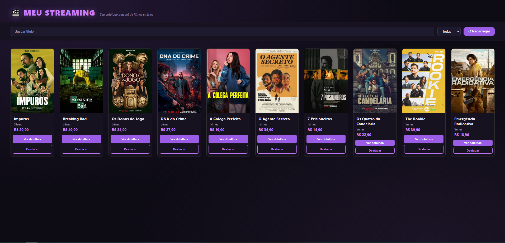
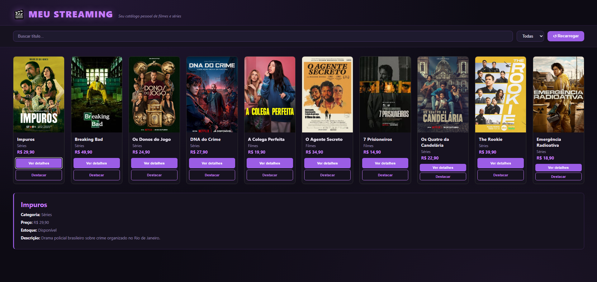
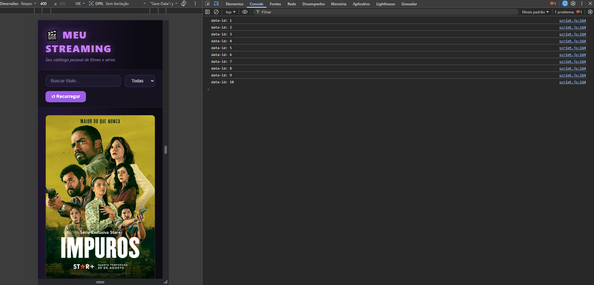

# Trabalho Prático - Semana 9

Nesta atividade, vamos montar um programa para praticar funções em JavaScript e a manipulação do DOM, criando uma tela simples no estilo eCommerce que lista produtos em cards a partir de um objeto JSON (array de produtos).

## Informações Gerais

- Nome: Glenda Magalhães
- Matricula: 927171

## Prints do trabalho

<< >>

<<  >>

<<  >>

